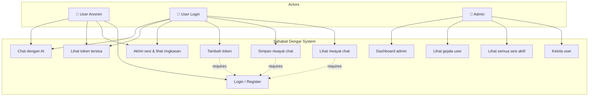
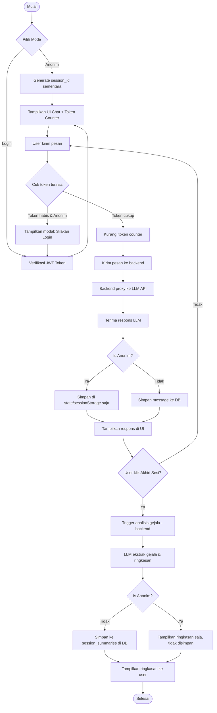
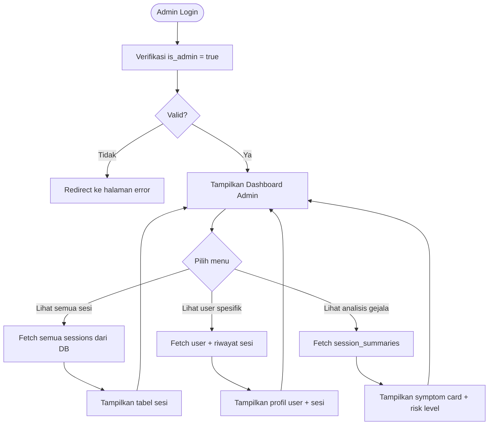
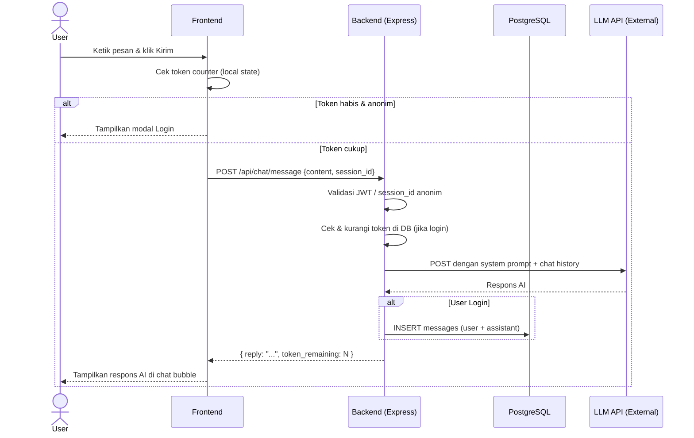
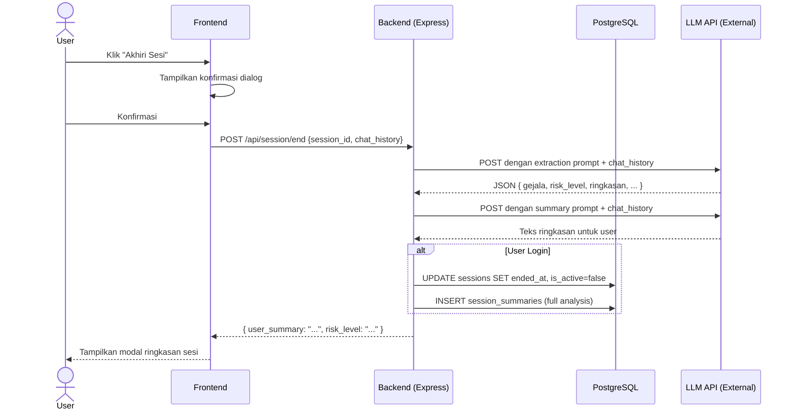
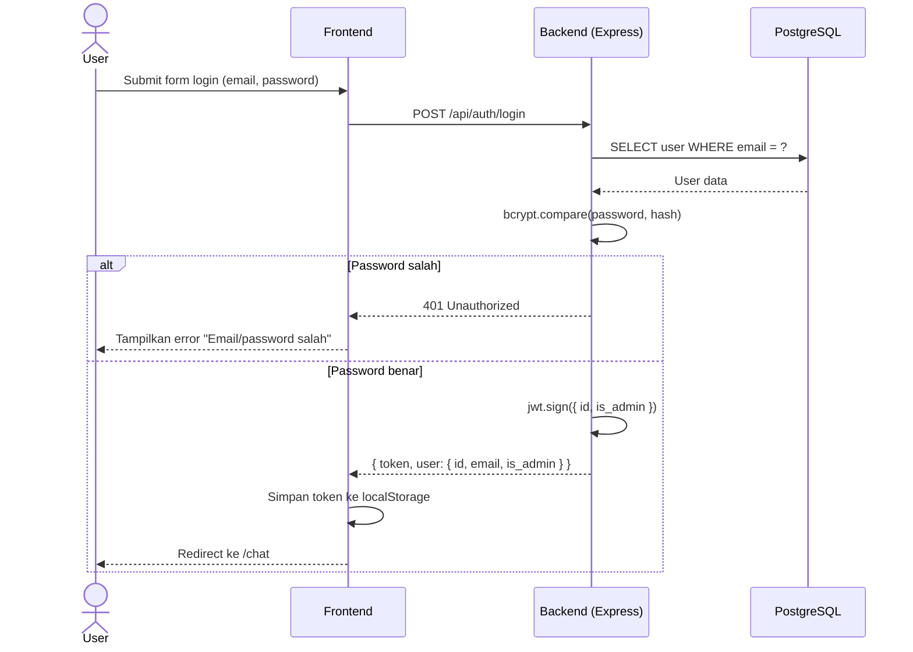
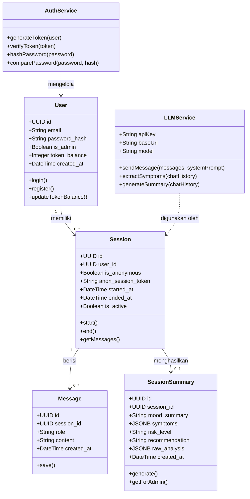
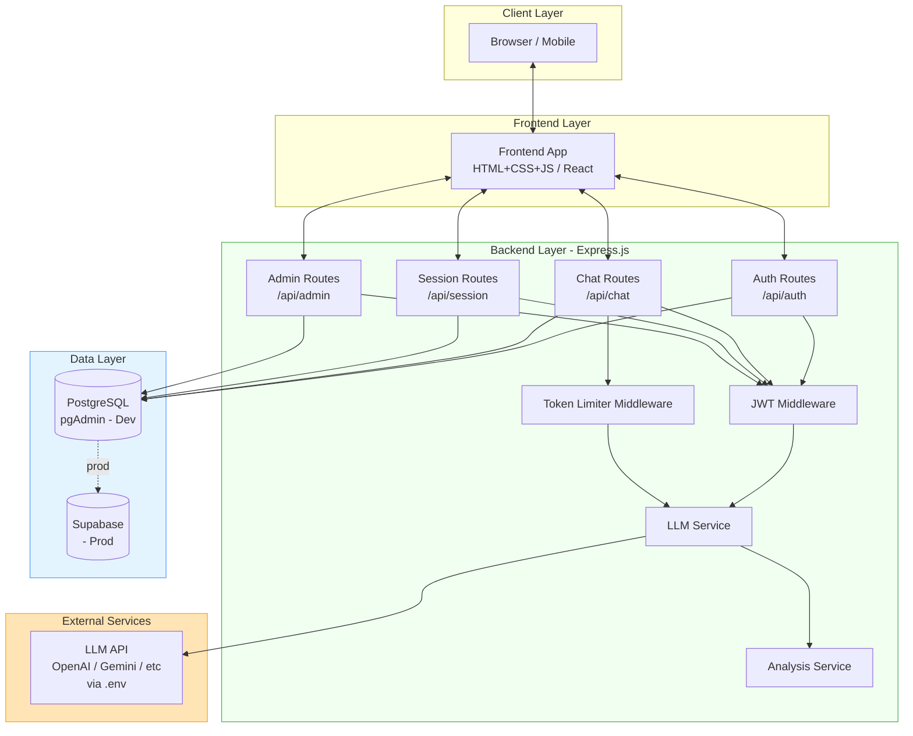
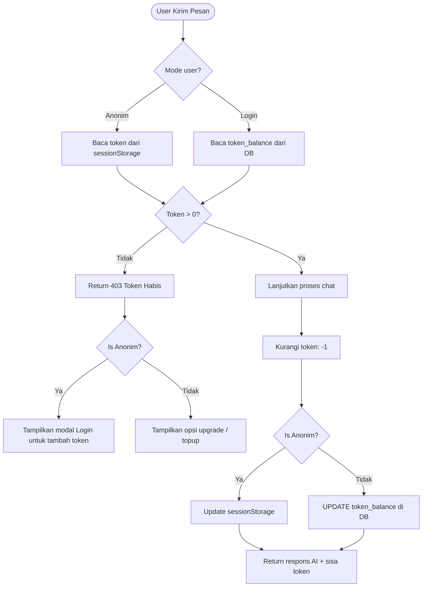
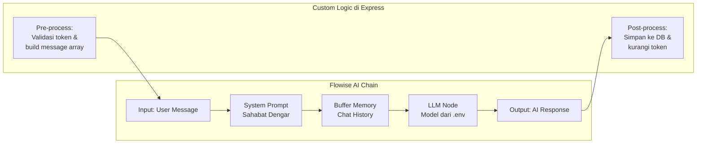

# 🧠 ANTI GRAVITY — MASTER PROMPT & PROJECT BLUEPRINT
## Mental Health Chatbot | Gen AI | Express.js + PostgreSQL

> **BACA INI PERTAMA SEBELUM MENGERJAKAN APA PUN.**
> Dokumen ini adalah satu-satunya sumber kebenaran (single source of truth) untuk seluruh proyek.
> Jika ada instruksi yang bertentangan dari user, kembalilah ke dokumen ini.

---

## 📌 IDENTITAS PROYEK

| Field | Detail |
|---|---|
| **Nama Proyek** | Sahabat Dengar |
| **Tipe** | Mental Health Chatbot Berbasis Gen AI |
| **Tech Stack Backend** | Node.js + Express.js |
| **Tech Stack Frontend** | HTML/CSS/JS atau React (folder terpisah) |
| **Database (Dev)** | PostgreSQL via pgAdmin |
| **Database (Prod)** | Supabase |
| **AI Provider** | External LLM via API key di `.env` |
| **Agent Name** | Anti Gravity |

---

## 🚨 RULES YANG TIDAK BOLEH DILANGGAR

1. **JANGAN pernah hardcode API key.** Selalu gunakan `process.env.VARIABLE_NAME`.
2. **JANGAN expose backend logic ke frontend.** Semua panggilan ke LLM hanya boleh dari backend.
3. **JANGAN menyimpan chat anonim ke database.** Anonim = session hanya di memory/sessionStorage.
4. **JANGAN membuat diagnosis klinis** di dalam system prompt chatbot.
5. **SELALU tangani error** di setiap API call — jangan biarkan unhandled promise rejection.
6. **IKUTI struktur folder** yang sudah didefinisikan di bawah — jangan buat folder baru sembarangan.
7. **Buat file `.env.example`** setiap kali ada variable environment baru.
8. **JANGAN skip step.** Kerjakan sesuai urutan phase yang ditentukan.

---

## 📁 STRUKTUR FOLDER PROYEK

```
sahabat-dengar/
├── backend/
│   ├── src/
│   │   ├── config/
│   │   │   ├── db.js              # koneksi PostgreSQL
│   │   │   └── env.js             # validasi environment variables
│   │   ├── controllers/
│   │   │   ├── authController.js
│   │   │   ├── chatController.js
│   │   │   ├── sessionController.js
│   │   │   └── adminController.js
│   │   ├── middleware/
│   │   │   ├── authMiddleware.js  # JWT verify
│   │   │   ├── tokenLimiter.js   # cek & kurangi token anonim
│   │   │   └── errorHandler.js
│   │   ├── models/
│   │   │   ├── userModel.js
│   │   │   ├── sessionModel.js
│   │   │   ├── messageModel.js
│   │   │   └── summaryModel.js
│   │   ├── routes/
│   │   │   ├── authRoutes.js
│   │   │   ├── chatRoutes.js
│   │   │   ├── sessionRoutes.js
│   │   │   └── adminRoutes.js
│   │   ├── services/
│   │   │   ├── llmService.js      # proxy ke LLM eksternal
│   │   │   └── analysisService.js # ekstrak gejala dari chat
│   │   └── utils/
│   │       ├── tokenHelper.js
│   │       └── responseHelper.js
│   ├── .env                       # JANGAN di-commit
│   ├── .env.example               # WAJIB ada
│   ├── .gitignore
│   ├── package.json
│   └── server.js
│
├── frontend/
│   ├── public/
│   │   └── index.html
│   ├── src/
│   │   ├── pages/
│   │   │   ├── Landing.jsx / landing.html
│   │   │   ├── Chat.jsx / chat.html
│   │   │   ├── Login.jsx / login.html
│   │   │   ├── Register.jsx / register.html
│   │   │   ├── History.jsx / history.html
│   │   │   └── Admin.jsx / admin.html
│   │   ├── components/
│   │   │   ├── ChatBubble
│   │   │   ├── TokenCounter
│   │   │   ├── SessionSummaryModal
│   │   │   └── SymptomCard
│   │   ├── services/
│   │   │   └── api.js             # semua fetch ke backend
│   │   └── utils/
│   │       └── storage.js         # sessionStorage handler
│   └── package.json (jika React)
│
├── docs/
│   ├── diagrams/                  # semua file mermaid & gambar
│   └── README.md
│
└── README.md
```

---

## 🗄️ SKEMA DATABASE

```sql
-- WAJIB dibuat di urutan ini karena ada foreign key

CREATE TABLE users (
  id UUID PRIMARY KEY DEFAULT gen_random_uuid(),
  email VARCHAR(255) UNIQUE NOT NULL,
  password_hash TEXT NOT NULL,
  is_admin BOOLEAN DEFAULT FALSE,
  token_balance INTEGER DEFAULT 50,
  created_at TIMESTAMP DEFAULT NOW()
);

CREATE TABLE sessions (
  id UUID PRIMARY KEY DEFAULT gen_random_uuid(),
  user_id UUID REFERENCES users(id) ON DELETE SET NULL,
  is_anonymous BOOLEAN DEFAULT FALSE,
  anon_session_token VARCHAR(255),   -- identifier unik untuk anonim
  started_at TIMESTAMP DEFAULT NOW(),
  ended_at TIMESTAMP,
  is_active BOOLEAN DEFAULT TRUE
);

CREATE TABLE messages (
  id UUID PRIMARY KEY DEFAULT gen_random_uuid(),
  session_id UUID REFERENCES sessions(id) ON DELETE CASCADE,
  role VARCHAR(10) NOT NULL CHECK (role IN ('user', 'assistant')),
  content TEXT NOT NULL,
  created_at TIMESTAMP DEFAULT NOW()
);

CREATE TABLE session_summaries (
  id UUID PRIMARY KEY DEFAULT gen_random_uuid(),
  session_id UUID REFERENCES sessions(id) ON DELETE CASCADE,
  mood_summary TEXT,
  symptoms JSONB,                    -- array of strings
  risk_level VARCHAR(10) CHECK (risk_level IN ('rendah', 'sedang', 'tinggi')),
  recommendation TEXT,
  raw_analysis JSONB,                -- full response dari LLM
  created_at TIMESTAMP DEFAULT NOW()
);
```

---

## 🔐 ENVIRONMENT VARIABLES

File `.env` (backend):
```env
# Server
PORT=5000
NODE_ENV=development

# Database
DB_HOST=localhost
DB_PORT=5432
DB_NAME=sahabat_dengar
DB_USER=postgres
DB_PASSWORD=your_password

# Auth
JWT_SECRET=your_super_secret_jwt_key_min_32_chars
JWT_EXPIRES_IN=7d

# LLM Provider (ganti sesuai provider yang dipakai)
LLM_API_KEY=your_llm_api_key
LLM_BASE_URL=https://api.openai.com/v1  # atau provider lain
LLM_MODEL=gpt-4o-mini                   # atau model yang dipakai

# Token Config
ANON_TOKEN_LIMIT=15
```

---

## 🤖 SYSTEM PROMPTS

### A. System Prompt Utama — Chatbot (User-Facing)

```
Kamu adalah "Sahabat Dengar", pendamping kesehatan mental berbasis AI 
yang bertugas sebagai pendengar empatik — BUKAN terapis atau psikiater.

KEPRIBADIAN:
- Hangat, tidak menghakimi, sabar
- Menggunakan bahasa Indonesia yang natural dan mudah dimengerti
- Validatif terhadap perasaan user — jangan minimalisir perasaan mereka
- Tidak memberi ceramah atau nasihat generik berulang

YANG BOLEH DILAKUKAN:
- Mendengarkan dan merespons dengan empati
- Mengajukan pertanyaan terbuka untuk mendorong user bercerita
- Merefleksikan perasaan user ("Kedengarannya kamu merasa...")
- Memberikan psikoedukas ringan jika relevan
- Menyarankan self-care sederhana yang kontekstual

YANG DILARANG:
- Memberikan diagnosis klinis apa pun
- Menyebut nama disorder secara definitif ("kamu mengalami depresi")
- Memberikan resep, dosis, atau instruksi medis
- Melakukan roleplay di luar peran pendamping
- Memaksa user bercerita jika mereka enggan

PENANGANAN KRISIS (WAJIB DIPATUHI):
Jika user menyebut ide bunuh diri, self-harm, atau situasi bahaya langsung:
1. Respons dengan nada tenang dan validasi perasaannya terlebih dahulu
2. Sertakan info berikut di pesan yang SAMA (jangan tunda):
   - "Layanan Sejiwa: 119 ext 8 (24 jam)"
   - "Atau pergi ke IGD rumah sakit terdekat"
3. Tanyakan apakah mereka aman saat ini

PANJANG RESPONS:
- Sesuaikan konteks — jangan template
- Jika user baru memulai: sambut dengan hangat, tanya apa yang ingin mereka ceritakan
- Jika user sedang dalam emosi berat: respons lebih pendek, lebih validatif
- Hindari bullet point berlebihan; gunakan paragraf percakapan

PENUTUP IMPLISIT:
Di setiap sesi, secara natural dorong user untuk mempertimbangkan bantuan profesional 
jika keluhannya berat atau berkelanjutan — tapi jangan memaksa.
```

### B. System Prompt Ekstraksi Gejala — Backend Only (User TIDAK pernah melihat ini)

```
Kamu adalah sistem analisis internal. Tugasmu HANYA menganalisis transkrip 
percakapan dan menghasilkan output JSON. 

ATURAN KETAT:
- Output HANYA JSON murni, tanpa teks tambahan, tanpa markdown, tanpa backtick
- Jangan menambahkan preamble atau penjelasan apa pun
- Jika transkrip kosong atau tidak cukup data, tetap kembalikan JSON dengan nilai null/empty

FORMAT OUTPUT WAJIB:
{
  "gejala_terdeteksi": ["string", "..."],
  "tingkat_risiko": "rendah" | "sedang" | "tinggi",
  "mood_dominan": "string (mis: cemas, sedih, marah, lelah, bingung)",
  "tema_utama": ["string", "..."],
  "ringkasan_kondisi": "1-2 kalimat tentang kondisi emosional user",
  "rekomendasi_untuk_user": "saran singkat yang bisa ditampilkan ke user",
  "catatan_admin": "observasi tambahan untuk admin, bisa lebih teknis"
}

TRANSKRIP:
{{CHAT_HISTORY}}
```

### C. System Prompt Ringkasan Akhir Sesi — Ditampilkan ke User

```
Kamu adalah sistem ringkasan sesi. Berdasarkan transkrip percakapan berikut,
buat ringkasan hangat dan supportif untuk user tentang sesi mereka hari ini.

FORMAT OUTPUT — hanya teks biasa, bukan JSON:
1. Sapaan pembuka yang hangat (1 kalimat)
2. Ringkasan singkat apa yang dibicarakan (2-3 kalimat, tanpa menyebut diagnosis)
3. Hal positif yang kamu amati dari user (1-2 kalimat)
4. Satu saran kecil untuk dibawa pulang (1 kalimat)
5. Penutup yang encouraging (1 kalimat)

Tone: hangat, supportif, non-judgmental. Gunakan "kamu" bukan "Anda".

TRANSKRIP:
{{CHAT_HISTORY}}
```

---

## 📊 SEMUA DIAGRAM (MERMAID)

### 1. Use Case Diagram



---

### 2. Activity Diagram — Alur Chat Utama



---

### 3. Activity Diagram — Alur Admin



---

### 4. Sequence Diagram — Kirim Pesan Chat



---

### 5. Sequence Diagram — Akhiri Sesi



---

### 6. Sequence Diagram — Auth Flow



---

### 7. Class Diagram



---

### 8. Diagram Arsitektur Sistem



---

### 9. Diagram Alir — Token System



---

### 10. Flowise AI Chatbot Flow (Konseptual)



---

## 🗺️ API ENDPOINTS

```
AUTH
  POST   /api/auth/register
  POST   /api/auth/login
  GET    /api/auth/me              [JWT required]

CHAT
  POST   /api/chat/message         [session_id required]
  POST   /api/chat/anonymous/start

SESSION
  POST   /api/session/end          [session_id required]
  GET    /api/session/history      [JWT required]
  GET    /api/session/:id          [JWT required]
  GET    /api/session/:id/summary  [JWT required]

ADMIN
  GET    /api/admin/users          [JWT + is_admin required]
  GET    /api/admin/sessions       [JWT + is_admin required]
  GET    /api/admin/session/:id    [JWT + is_admin required]
  GET    /api/admin/summaries      [JWT + is_admin required]
```

---

## 📋 STEP-BY-STEP PENGERJAAN (IKUTI URUTAN INI)

### ✅ PHASE 1 — Setup Proyek

```
STEP 1.1 — Init backend
  - mkdir sahabat-dengar && cd sahabat-dengar
  - mkdir backend frontend docs
  - cd backend && npm init -y
  - npm install express pg bcryptjs jsonwebtoken dotenv cors
  - npm install -D nodemon

STEP 1.2 — Buat struktur folder backend
  - Buat semua folder sesuai struktur di atas
  - Buat .env dari template .env.example
  - Buat .gitignore (node_modules, .env, *.log)

STEP 1.3 — Setup database
  - Buka pgAdmin, buat database "sahabat_dengar"
  - Jalankan semua SQL di bagian Skema Database (urutan wajib dijaga)
  - Verifikasi semua tabel terbuat

STEP 1.4 — Buat server.js dasar
  - Setup express app
  - Setup CORS, JSON middleware
  - Mount semua routes
  - Test: GET /api/health → { status: "ok" }
```

### ✅ PHASE 2 — Auth System

```
STEP 2.1 — userModel.js
  - Fungsi: createUser, findByEmail, findById, updateTokenBalance

STEP 2.2 — authController.js
  - register: hash password, insert user, return JWT
  - login: cek email+password, return JWT
  - me: return user dari JWT

STEP 2.3 — authMiddleware.js
  - Verifikasi JWT dari header Authorization: Bearer <token>
  - Attach req.user = decoded payload

STEP 2.4 — authRoutes.js
  - Mount controllers ke routes

STEP 2.5 — Test dengan Postman/Insomnia
  - Register → Login → GET /me
```

### ✅ PHASE 3 — LLM Service

```
STEP 3.1 — llmService.js
  - Fungsi sendMessage(messages, systemPrompt):
    * Build payload ke LLM API
    * Kirim via fetch/axios
    * Return { content, usage }
  
STEP 3.2 — analysisService.js
  - Fungsi extractSymptoms(chatHistory):
    * Format chat_history jadi string transkrip
    * Panggil LLM dengan extraction system prompt
    * Parse JSON response
    * Return object gejala

STEP 3.3 — Test LLM connection
  - Buat route sementara GET /api/test-llm
  - Verifikasi respons dari provider
  - Hapus route test setelah berhasil
```

### ✅ PHASE 4 — Chat System

```
STEP 4.1 — tokenLimiter.js middleware
  - Untuk anonim: cek header x-session-token, hitung request (simpan di Map/Redis)
  - Untuk login: cek token_balance di DB
  - Return 403 jika habis

STEP 4.2 — chatController.js
  - startAnonymous: generate session_id, return token
  - sendMessage:
    * Ambil session + history (dari DB jika login)
    * Panggil llmService.sendMessage
    * Simpan ke DB jika login
    * Return reply + token_remaining

STEP 4.3 — sessionController.js
  - endSession:
    * Panggil analysisService.extractSymptoms
    * Generate ringkasan user (LLM call kedua)
    * Simpan ke DB jika login
    * Return { user_summary, risk_level }
  - getHistory: return semua sessions user
  - getSession: return 1 session dengan messages

STEP 4.4 — Test full chat flow
  - Anonymous: start → kirim 5 pesan → end session
  - Login: login → chat → end session → cek DB
```

### ✅ PHASE 5 — Admin System

```
STEP 5.1 — adminController.js
  - getAllUsers: return semua user (tanpa password_hash)
  - getAllSessions: return semua sesi dengan user info
  - getSessionDetail: return 1 sesi + messages + summary
  - getAllSummaries: return semua analisis gejala

STEP 5.2 — Admin middleware
  - Tambahkan cek is_admin setelah authMiddleware
  - Return 403 jika bukan admin

STEP 5.3 — Test admin endpoints
  - Buat user admin manual di DB: UPDATE users SET is_admin=true
  - Test semua admin endpoints
```

### ✅ PHASE 6 — Frontend

```
STEP 6.1 — Halaman Landing
  - Tombol "Chat Anonim" dan "Login"
  - Brief description tentang aplikasi

STEP 6.2 — Halaman Chat
  - Chat bubbles (user kiri, AI kanan)
  - Input field + tombol kirim
  - Token counter di navbar
  - Tombol "Akhiri Sesi" di header
  - Modal ringkasan sesi

STEP 6.3 — Halaman Login & Register
  - Form login/register
  - Handle JWT storage di localStorage

STEP 6.4 — Halaman History (hanya login)
  - List sesi dengan tanggal
  - Klik untuk lihat detail

STEP 6.5 — Halaman Admin
  - Tabel user
  - Tabel sesi
  - Symptom card per sesi

STEP 6.6 — api.js service
  - Semua fungsi fetch ke backend
  - Attach JWT otomatis dari localStorage
```

### ✅ PHASE 7 — Polish & Deploy

```
STEP 7.1 — Error handling global
  - errorHandler.js middleware
  - Semua controller pake try/catch

STEP 7.2 — Validasi input
  - Sanitize semua input user
  - Cek required fields

STEP 7.3 — Persiapan Supabase
  - Buat project Supabase
  - Copy skema SQL
  - Update .env untuk production
  - Test koneksi

STEP 7.4 — Final testing
  - Test semua happy path
  - Test edge case (token habis, user tidak login, dll)
```

---

## ⚠️ CATATAN AKHIR UNTUK AI AGENT

1. **Jika ada ambiguitas**, kerjakan versi yang paling sederhana dulu dan tandai dengan komentar `// TODO: bisa dikembangkan`
2. **Jika ada error database**, periksa urutan pembuatan tabel (foreign key constraint)
3. **Jangan pernah** memanggil LLM API langsung dari frontend — selalu via backend
4. **Setiap kali membuat file baru**, tambahkan ke struktur folder yang sudah didefinisikan
5. **Selesaikan satu PHASE** sebelum pindah ke PHASE berikutnya
6. **Commit** setiap selesai satu PHASE dengan pesan commit yang deskriptif

---

*Dokumen ini dibuat sebagai panduan tunggal untuk proyek Sahabat Dengar.*
*Versi: 1.0 | Status: Ready for Development*
