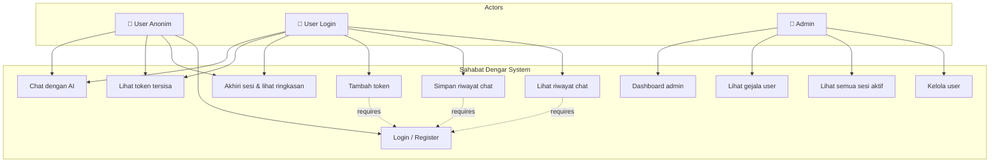
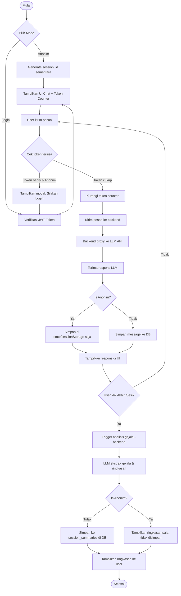
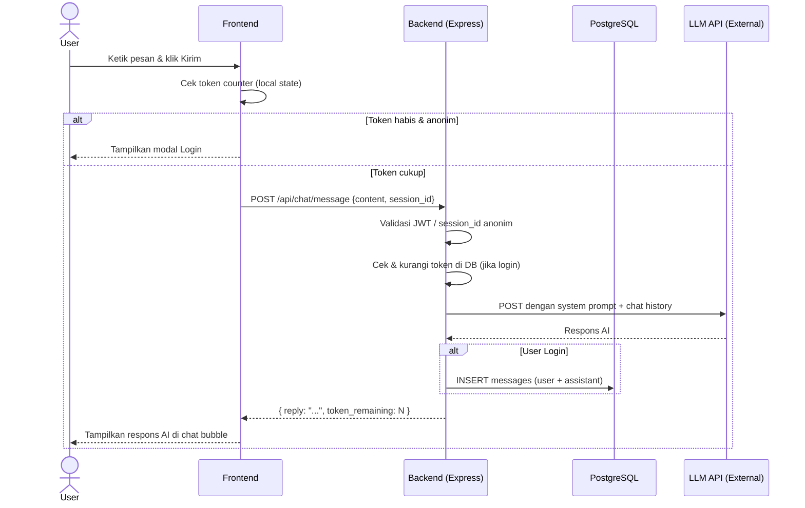
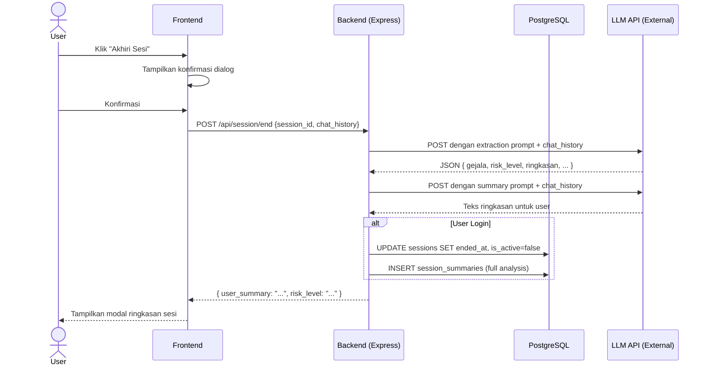
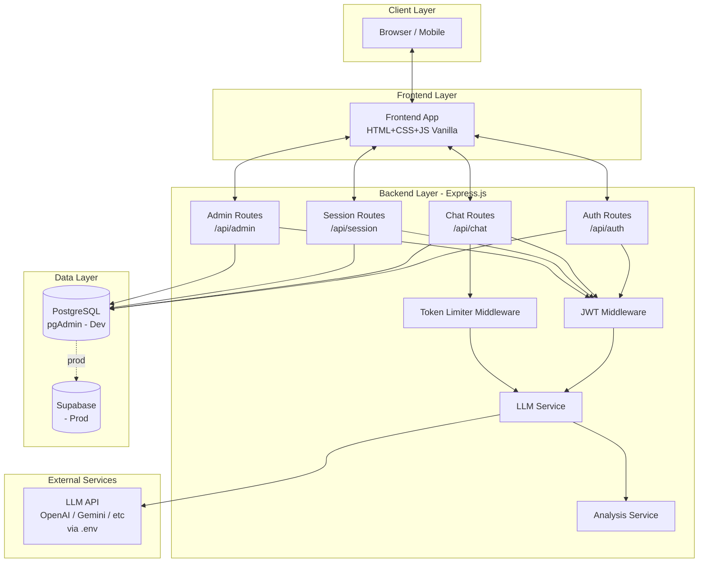

# 📊 Dokumentasi Sistem & Diagram Arsitektur — Sahabat Dengar

Dokumen ini berisi seluruh diagram sistem perancangan aplikasi **Sahabat Dengar**.

---

## 1. Use Case Diagram

---

## 2. Activity Diagram — Alur Chat Utama

---

## 3. Sequence Diagram — Kirim Pesan Chat

---

## 4. Sequence Diagram — Akhiri Sesi & Ekstraksi Gejala

---

## 5. Diagram Arsitektur Sistem

